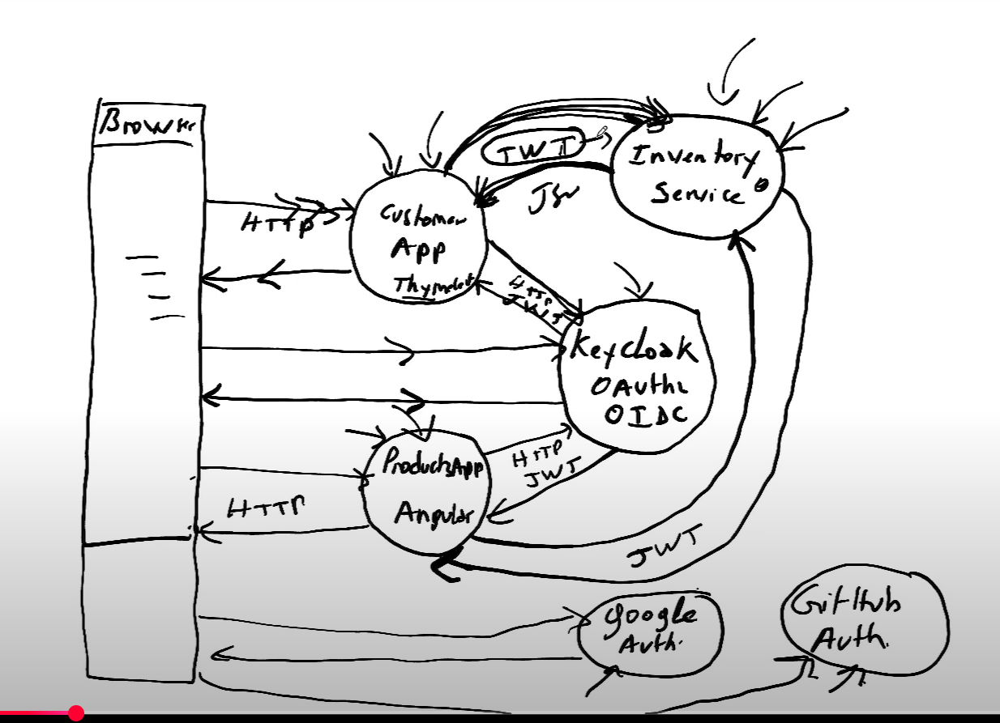

# Spring Security Application

Une application d'entreprise moderne construite avec **Spring Boot**, **Spring Security** et **Keycloak** pour la gestion de l'authentification et de l'autorisation.

## 📋 Table des matières

- [Vue d'ensemble](#vue-densemble)
- [Architecture](#architecture)
- [Prérequis](#prérequis)
- [Installation](#installation)
- [Configuration](#configuration)
- [Structure du projet](#structure-du-projet)
- [Utilisation](#utilisation)
- [Technologies](#technologies)
- [Diagramme des cas d'utilisation](#diagramme-des-cas-dutilisation)
- [Contribution](#contribution)
- [Licence](#licence)

## 🎯 Vue d'ensemble

Cette application est une solution complète d'authentification et de gestion des utilisateurs basée sur :

- **Spring Security** : Framework de sécurité robuste et flexible
- **Keycloak** : Solution IAM (Identity and Access Management) open-source
- **Spring Boot** : Framework de développement Java simplifié
- **Microservices** : Architecture modulaire avec plusieurs services

### Caractéristiques principales

✅ Authentification centralisée avec Keycloak  
✅ Gestion des utilisateurs et des rôles  
✅ Services de microservices (Inventory, Customer, etc.)  
✅ Interfaces web avec Thymeleaf et Angular  
✅ Sécurité au niveau entreprise  

## 🏗️ Architecture

```
Spring-Security-app/
├── inventory-service/          # Service de gestion des inventaires
├── customer-front-theymeleaf-app/  # Frontend Thymeleaf pour clients
├── costumer-front-angular-app/     # Frontend Angular pour clients
├── keycloak-26.4.0/            # Configuration et données Keycloak
├── schema.txt                  # Schéma de base de données
└── cas-utilisation.png         # Diagramme des cas d'utilisation
```

## 📦 Composition du projet

| Langage | Pourcentage |
|---------|-----------|
| Java | 42.1% |
| Batchfile | 21.3% |
| Shell | 20.6% |
| HTML | 16% |

## 🔧 Prérequis

Avant de démarrer, assurez-vous d'avoir installé :

- **Java 17+** (JDK)
- **Maven 3.8+**
- **Docker** (optionnel, pour Keycloak)
- **Node.js 18+** (pour le frontend Angular)

## 📥 Installation

### 1. Cloner le repository

```bash
git clone https://github.com/FAHDELL/Spring-Security-app.git
cd Spring-Security-app
```

### 2. Configurer Keycloak

Keycloak est inclus dans le répertoire `keycloak-26.4.0/`. Vous pouvez le démarrer via Docker :

```bash
docker run -d \
  -e KEYCLOAK_ADMIN=admin \
  -e KEYCLOAK_ADMIN_PASSWORD=admin \
  -p 8080:8080 \
  -v $(pwd)/keycloak-26.4.0:/opt/keycloak/data \
  quay.io/keycloak/keycloak:26.4.0 start-dev
```

Accédez à la console Keycloak : [http://localhost:8080](http://localhost:8080)

### 3. Construire les services

#### Service d'inventaires

```bash
cd inventory-service
mvn clean install
mvn spring-boot:run
```

Le service s'exécute sur : [http://localhost:8888](http://localhost:8888)

#### Frontend Thymeleaf

```bash
cd customer-front-theymeleaf-app
mvn clean install
mvn spring-boot:run
```

L'application s'exécute sur : [http://localhost:8081](http://localhost:8081)

#### Frontend Angular

```bash
cd costumer-front-angular-app
npm install
ng serve
```

L'application s'exécute sur : [http://localhost:4200](http://localhost:4200)

## ⚙️ Configuration

### Variables d'environnement

Créez un fichier `.env` à la racine du projet :

```env
# Keycloak
KEYCLOAK_SERVER_URL=http://localhost:8080
KEYCLOAK_REALM=master
KEYCLOAK_CLIENT_ID=your-client-id
KEYCLOAK_CLIENT_SECRET=your-client-secret

# Base de données
DATABASE_URL=jdbc:mysql://localhost:3306/spring_security_app
DATABASE_USER=root
DATABASE_PASSWORD=your_password

# Application
APP_PORT=8081
APP_CONTEXT_PATH=/
```

### Configuration Spring Security

Le fichier `application.yml` ou `application.properties` doit contenir :

```yaml
spring:
  security:
    oauth2:
      resourceserver:
        jwt:
          issuer-uri: http://localhost:8080/realms/master
          jwk-set-uri: http://localhost:8080/realms/master/protocol/openid-connect/certs
```

## 📁 Structure du projet

```
Spring-Security-app/
├── inventory-service/
│   ├── src/
│   │   ├── main/java/...
│   │   └── main/resources/
│   └── pom.xml
├── customer-front-theymeleaf-app/
│   ├── src/
│   └── pom.xml
├── costumer-front-angular-app/
│   ├── src/
│   ├── package.json
│   └── angular.json
├── keycloak-26.4.0/
│   └── [Configuration Keycloak]
└── schema.txt
```

## 🚀 Utilisation

### Scénarios principaux

1. **Authentification** : Les utilisateurs se connectent via Keycloak
2. **Autorisation** : Les rôles et permissions sont vérifiés par Spring Security
3. **Accès aux services** : Les clients accèdent aux microservices sécurisés
4. **Gestion d'inventaire** : Consultation et gestion de l'inventaire via l'API

### Endpoints principaux

```
GET  /api/inventory       - Liste les articles
GET  /api/inventory/{id}  - Détails d'un article
POST /api/inventory       - Créer un article (Admin)
PUT  /api/inventory/{id}  - Modifier un article (Admin)
DELETE /api/inventory/{id} - Supprimer un article (Admin)
```

## 🛠️ Technologies

| Technologie | Version | Utilisation |
|------------|---------|------------|
| **Spring Boot** | 3.x | Framework principal |
| **Spring Security** | 6.x | Authentification/Autorisation |
| **Spring Cloud** | - | Microservices |
| **Keycloak** | 26.4.0 | Gestion d'identité (IAM) |
| **Maven** | 3.8+ | Build & dépendances |
| **MySQL/PostgreSQL** | - | Base de données |
| **Angular** | 18+ | Frontend SPA |
| **Thymeleaf** | 3.x | Template engine |

## 📊 Diagramme des cas d'utilisation



## 🤝 Contribution

Les contributions sont les bienvenues ! Pour contribuer :

1. Fork le projet
2. Créez une branche feature (`git checkout -b feature/AmazingFeature`)
3. Committez vos changements (`git commit -m 'Add some AmazingFeature'`)
4. Poussez vers la branche (`git push origin feature/AmazingFeature`)
5. Ouvrez une Pull Request

## 📝 Licence

Ce projet n'a pas de licence spécifiée. Veuillez contacter le propriétaire pour les détails d'utilisation.

## 📧 Contact

- **Auteur** : [FAHDELL](https://github.com/FAHDELL)
- **Repository** : [Spring-Security-app](https://github.com/FAHDELL/Spring-Security-app)
- **Issues** : [GitHub Issues](https://github.com/FAHDELL/Spring-Security-app/issues)

---

**Dernière mise à jour** : 11 juin 2026

*Construit avec ❤️ pour la sécurité d'entreprise*
